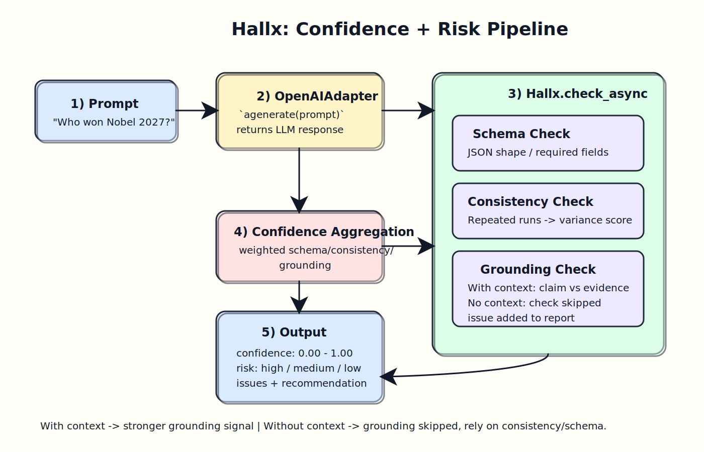

# hallx

[](https://github.com/dhanushk-offl/hallx/actions/workflows/test.yml)
[](https://github.com/dhanushk-offl/hallx/actions/workflows/release.yml)
[](https://scorecard.dev/viewer/?uri=github.com/dhanushk-offl/hallx)
[](https://pypi.org/project/hallx/)

Hallx is a lightweight guardrail library for LLM outputs.  
It helps teams answer one practical question before trusting model output:

`How risky is this response for my production workflow?`

## The Story Behind Hallx

In production, LLM failures are often subtle:

- output looks fluent but is unsupported by evidence
- JSON looks close but breaks strict consumers
- repeated generations drift too much for reliable automation

Most teams need a fast way to quantify that risk and decide what to do next.
Hallx gives that decision layer as a simple API:

- score the response
- surface issues
- choose proceed or retry
- improve policy over time with feedback

## What Hallx Does

| Capability | Output |
|---|---|
| Response risk scoring | `confidence` (`0.0` to `1.0`) |
| Risk categorization | `risk_level` (`high`, `medium`, `low`) |
| Diagnostics | `issues` list |
| Runtime guidance | `recommendation` payload |
| Governance loop | feedback storage + calibration report |

## Why Teams Use Hallx

- It is easy to plug into existing API/worker pipelines.
- It is lightweight compared to full evaluator frameworks.
- It is operationally useful, not just theoretical.
- It supports both sync and async codepaths.

## Who Should Use Hallx

Hallx is a good fit for:

- teams shipping RAG/chat features
- products returning machine-consumed JSON
- backend workflows where LLM output triggers actions
- QA/ops teams building risk policy and retry controls

Hallx is not a replacement for domain-specific verification in high-stakes contexts (medical, legal, financial).

## Scoring Model

Hallx uses three heuristic signals:

- `schema`: structured output validity
- `consistency`: stability across repeated generations
- `grounding`: claim-context alignment

Formula:

```text
confidence = clamp(
  schema_score * w_schema +
  consistency_score * w_consistency +
  grounding_score * w_grounding,
  0.0, 1.0
)
```

Default balanced weights:

- `w_schema = 0.34`
- `w_consistency = 0.33`
- `w_grounding = 0.33`

Risk mapping:

- `< 0.40` -> `high`
- `< 0.75` -> `medium`
- `>= 0.75` -> `low`

## End-to-End Workflow



1. Receive prompt and optional context/schema.
2. Generate response through adapter/callable.
3. Run schema/consistency/grounding checks.
4. Compute confidence and risk level.
5. Apply runtime policy (`proceed` or `retry`).
6. Store reviewed outcomes and calibrate thresholds over time.

## Quick Start

```python
from hallx import Hallx

checker = Hallx(profile="balanced")
result = checker.check(
    prompt="Summarize refund policy",
    response={"summary": "Refunds are allowed within 30 days."},
    context=["Refunds are allowed within 30 days of purchase."],
)

print(result.confidence, result.risk_level)
print(result.issues)
print(result.recommendation)
```

## Safety Profiles

| Profile | Goal | Default `consistency_runs` | Skip penalty |
|---|---|---:|---:|
| `fast` | lower latency | 2 | 0.15 |
| `balanced` | general purpose | 3 | 0.25 |
| `strict` | stronger scrutiny | 4 | 0.40 |

## Adapters

OpenAI, Anthropic, Gemini, OpenRouter, Perplexity, Grok, HuggingFace, Ollama.

## Feedback and Calibration

Hallx supports outcome review storage and policy tuning:

- `record_outcome(...)`
- `calibration_report(...)`

## Next Reading

- Usage patterns: [USAGE.md](USAGE.md)
- Production guidance: [PRODUCTION.md](PRODUCTION.md)
- Contributing: [../CONTRIBUTING.md](../CONTRIBUTING.md)
- Code of Conduct: [../CODE_OF_CONDUCT.md](../CODE_OF_CONDUCT.md)
